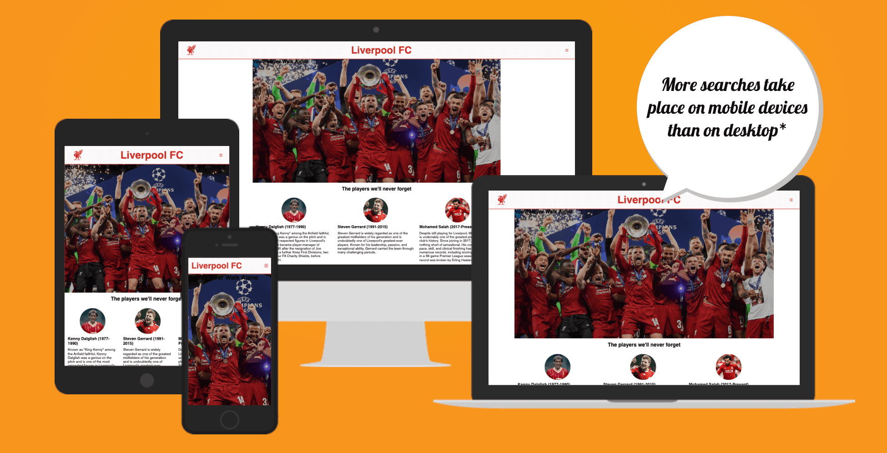

# Liverpool Page

This Liverpool page is made for Liverpool supporters or just football supporters in general, who wishes to read about some of the best players in the clubs history, look at some memorable moments in the gallery section or find the links to our social media groups.

The live link to the site is found here: [Liverpool FC info page](https://antongustafsson97.github.io/Liverpool-Footballclub-Info-page/)

## Site Owner Goals

- To provide the user with information about Liverpool FC.
- To present the user with a website that is easy to navigate and fully responsive.
- To enable the user to locate our social media groups for even more news. 
- To provide a newsletter for the fans that want more news sent to their emial.

## User Stories

- ### First time user

  - As a first time user I want to understand the main purpose of the site and learn about the club and players.
  - As a first time user I want to be able to easily navigate through the site.
  - As a first time user I want to be able to look around at pictures and information about the club without having to sign up.

- ### Frequent User

  - As a frequent user I want to be able to sign-up to the newsletter to get even more news and updates about the site.
  
## Design

### Imagery

The imagery of players and historical moments displayed on the site is choosen to make the user recognize the greatness of this football club.

### Colours

The colours used on the site is the classic red and white which Liverpool have been wearing on the field throughout the history.

### Fonts

The roboto font is the main font seen on the site. This font was imported via [Google Fonts](https://fonts.google.com/). 
Sans Serif is used as a backup font, in case for any reason the main font isn't being imported into the site correctly. 

## Features

- ### Navigation

    - The navigation bar in the header section is responsive and can with just two clicks take you the a specific section of the site
    - The navigation is set to a fixed position meaning that if you are currently looking at some pictues in the middle of the site, you can still see the header with the menu. This feature makes it very user friendly. 

- ### The Home page
  - The Home page displays an image which tells the user what kind of site this is and what they can expect to fint here.
  - If you scroll down a bit you will find some of the most iconic players in the history of the club and some pictues of them.
  
- ### The Gallery page
  - The Gallery page is a made to let the user scroll through some historical moments in the clubs history.

- ### The Sign-up page
  - The signup page is imporant to give the user an opportunity to get more info and updates regarding the site and the club.

- ### Footer
  - in the footer section you can find all the links to our social media groups on Facebook, Twitter, Youtube and Instagram.

### Features Left to Implement

- A section with the latest game results. 
- A live Premier League table.

## Testing
# Liverpool Page

This Liverpool page is made for Liverpool supporters or just football supporters in general, who wishes to read about some of the best players in the clubs history, look at some memorable moments in the gallery section or find the links to our social media groups.

The live link to the site is found here: [Liverpool FC info page](https://antongustafsson97.github.io/Liverpool-Footballclub-Info-page/)

## Site Owner Goals

- To provide the user with information about Liverpool FC.
- To present the user with a website that is easy to navigate and fully responsive.
- To enable the user to locate our social media groups for even more news. 
- To provide a newsletter for the fans that want more news sent to their emial.

## User Stories

- ### First time user

  - As a first time user I want to understand the main purpose of the site and learn about the club and players.
  - As a first time user I want to be able to easily navigate through the site.
  - As a first time user I want to be able to look around at pictures and information about the club without having to sign up.

- ### Frequent User

  - As a frequent user I want to be able to sign-up to the newsletter to get even more news and updates about the site.
  
## Design

### Imagery

The imagery of players and historical moments displayed on the site is choosen to make the user recognize the greatness of this football club.

### Colours

The colours used on the site is the classic red and white which Liverpool have been wearing on the field throughout the history.

### Fonts

The roboto font is the main font seen on the site. This font was imported via [Google Fonts](https://fonts.google.com/). 
Sans Serif is used as a backup font, in case for any reason the main font isn't being imported into the site correctly. 

## Features

- ### Navigation

    - The navigation bar in the header section is responsive and can with just two clicks take you the a specific section of the site
    - The navigation is set to a fixed position meaning that if you are currently looking at some pictues in the middle of the site, you can still see the header with the menu. This feature makes it very user friendly. 

- ### The Home page
  - The Home page displays an image which tells the user what kind of site this is and what they can expect to fint here.
  - If you scroll down a bit you will find some of the most iconic players in the history of the club and some pictues of them.
  
- ### The Gallery page
  - The Gallery page is a made to let the user scroll through some historical moments in the clubs history.

- ### The Sign-up page
  - The signup page is imporant to give the user an opportunity to get more info and updates regarding the site and the club.

- ### Footer
  - in the footer section you can find all the links to our social media groups on Facebook, Twitter, Youtube and Instagram.

### Features Left to Implement

- A section with the latest game results. 
- A live Premier League table.

## Testing
