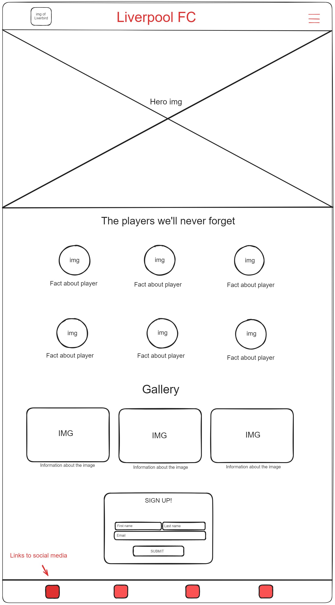
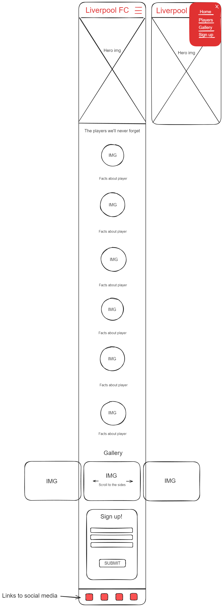
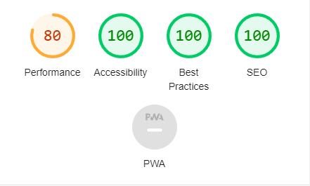

# Liverpool Page

This Liverpool page is made for Liverpool supporters or just football supporters in general, who wishes to read about some of the best players in the clubs history, look at some memorable moments in the gallery section or find the links to our social media groups.

The live link to the site is found here: [Liverpool FC info page](https://antongustafsson97.github.io/Liverpool-Footballclub-Info-page/)

## Site Owner Goals

- To provide the user with information about Liverpool FC.
- To present the user with a website that is easy to navigate and fully responsive.
- To enable the user to locate our social media groups for even more news. 
- To provide a newsletter for the fans that want more news sent to their emial.

## User Stories

- ### First time user

  - As a first time user I want to understand the main purpose of the site and learn about the club and players.
  - As a first time user I want to be able to easily navigate through the site.
  - As a first time user I want to be able to look around at pictures and information about the club without having to sign up.

- ### Frequent User

  - As a frequent user I want to be able to sign-up to the newsletter to get even more news and updates about the site.
  
## Design

### Imagery

The imagery of players and historical moments displayed on the site is choosen to make the user recognize the greatness of this football club.

### Colours

The colours used on the site is the classic red and white which Liverpool have been wearing on the field throughout the history.

### Fonts

The roboto font is the main font seen on the site. This font was imported via [Google Fonts](https://fonts.google.com/). 
Sans Serif is used as a backup font, in case for any reason the main font isn't being imported into the site correctly.

## Wireframes

Wireframes were produced using Balsamiq.

Desktop Wireframe

Mobile Wireframe

## Features

- ### Navigation

  - The navigation bar in the header section is responsive and can with just two clicks take you the a specific section of the site
  - The navigation is set to a fixed position meaning that if you are currently looking at some pictues in the middle of the site, you can still see the header with the menu. This feature makes it very user friendly.

- ### The Landing page
  - The Home page displays an image which tells the user what kind of site this is and what they can expect to fint here.
  - If you scroll down a bit you will find some of the most iconic players in the history of the club and some pictues of them.

  
- ### The Gallery page
  - The Gallery page is a made to let the user scroll through some historical moments in the clubs history.

 

- ### The Sign-up page
  - The signup page is imporant to give the user an opportunity to get more info and updates regarding the site and the club.

 

- ### Footer
  - in the footer section you can find all the links to our social media groups on Facebook, Twitter, Youtube and Instagram.

 

### Features Left to Implement

- A section with the latest game results. 
- A live Premier League table.

## Testing

- #### HTML
  - No errors were returned when passing through the official W3C Markup Validator
    - [W3C Validator Results](https://validator.w3.org/nu/?doc=https%3A%2F%2Fantongustafsson97.github.io%2FLiverpool-Footballclub-Info-page%2F)

- #### CSS
  - No errors were found when passing through the official W3C CSS Validator
    - [W3C CSS Validator Results](https://jigsaw.w3.org/css-validator/validator?uri=https%3A%2F%2Fantongustafsson97.github.io%2FLiverpool-Footballclub-Info-page%2F&profile=css3svg&usermedium=all&warning=1&vextwarning=&lang=sv)

- #### Accessibility
  - The site achieved a Lighthouse accessibility score of 100% which means that the fonts and colors are easy to read.

### Form Testing
- The form is tested and it will not allow you to submit without entering an email address and your fullname and lastname.

### Links Testing

- All navigation links were tested manually to ensure the user is directed to the correct section of the website.
- The social media links in the footer have been tested manually to ensure you are directed to the correct platform and that it opens in a new window.

### Browser Testing

-The website has been tested on Google chrome, Safari, Firefox and Microsoft Edge. No errors noted.

### Device Testing

-The website was tested on multiple devices such as Samsung Galaxy Fold, Ipad mini, Iphone x, Desktop and Laptop. It works as it should on all devices and it is responsive.
-The following website were used for responsive tests:
   
   - [Responsinator] (http://www.responsinator.com/?url=https%3A%2F%2Fantongustafsson97.github.io%2FLiverpool-Footballclub-Info-page%2Findex.html)
   - [Am i responsive] (https://ui.dev/amiresponsive?url=https://antongustafsson97.github.io/Liverpool-Footballclub-Info-page/index.html)

### Friends and Family User Testing
I asked my family and a couple of friends to look at the website and tell me anything they felt were disturbing or hard to understand.

### Fixed Bugs
 
-The gallery section had a max-height set to it which led to a scrollbar appeared. By removing the max-height it fixed the issue.

-The list in the nav element was not visable becuase it took the same color as the background of the menu. By creating a class for each list item i could then apply styles directly to them, setting their color to white instead of the red that the menu had.

### Known Bugs

-HTML Smooth scroll does not work on Safari browser.

## Technologies Used

### Languages

- HTML5
- CSS

### Frameworks - Libraries - Programs Used

- [Am I Responsive](http://ami.responsivedesign.is/) - Used to verify responsiveness of website on different devices.
- [Responsinator](http://www.responsinator.com/) - Used to verify responsiveness of website on different devices.
- [Chrome Dev Tools](https://developer.chrome.com/docs/devtools/) - Used for overall development and tweaking, including testing responsiveness and performance.
- [Font Awesome](https://fontawesome.com/) - Used for Social Media icons in footer.
- [GitHub](https://github.com/) - Used for version control and hosting.
- [Google Fonts](https://fonts.google.com/) - Used to import and alter fonts on the page.
- [TinyPNG](https://tinypng.com/) - Used to compress images to reduce file size without a reduction in quality.
- [W3C](https://www.w3.org/) - Used for HTML & CSS Validation.

## Deployment

The project was deployed using GitHub pages. The steps to deploy using GitHub pages are:

1. Go to the repository on GitHub.com
2. Select 'Settings' near the top of the page.
3. Select 'Pages' from the menu bar on the left of the page.
4. Under 'Source' select the 'Branch' dropdown menu and select the main branch.
5. Once selected, click the 'Save'.
6. Deployment should be confirmed by a message on a green background saying "Your site is published at" followed by the web address.

The live link can be found here - [Liverpool FC Info Page](https://antongustafsson97.github.io/Liverpool-Footballclub-Info-page/)

## Credits

### Content
All information about the club and players was found at these websites:

-[Give Me Sport](https://www.givemesport.com/)
-[Wikipedia](https://www.wikipedia.org/)

### Media
All the images displayed on the website was found on these website:

-[Britanica](https://www.britannica.com/)
-[Wikipedia](https://www.wikipedia.org/)
-[The Irish Sun](https://www.thesun.ie/)
-[The Guardian](https://www.theguardian.com/europe)

## Acknowledgments

I would like to thank everyone on the Slack community who helped me when i got stuck. Very quick and helpful responses.

I would also like to thank my mentor Antonio for the help he gave me and his input in the project.

